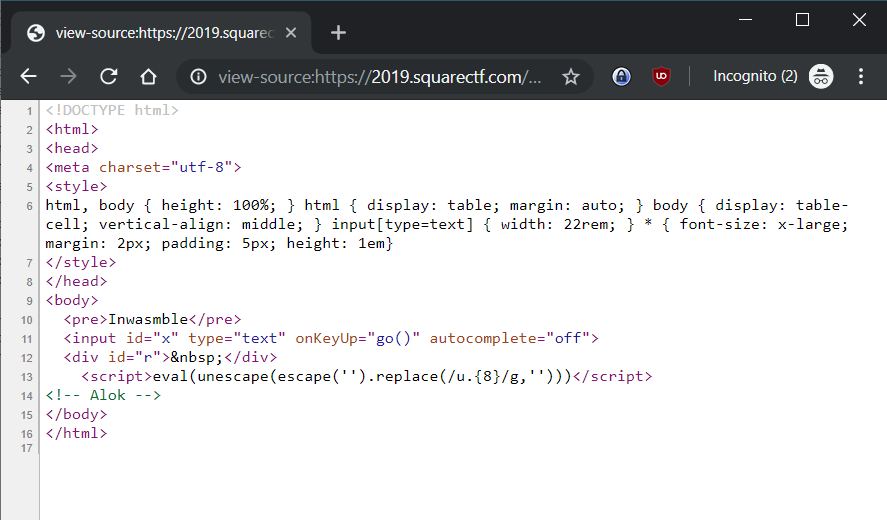
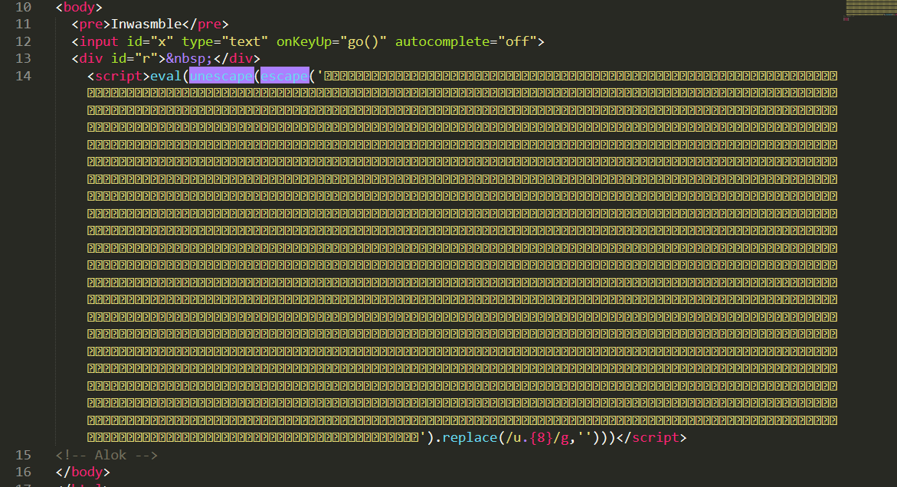
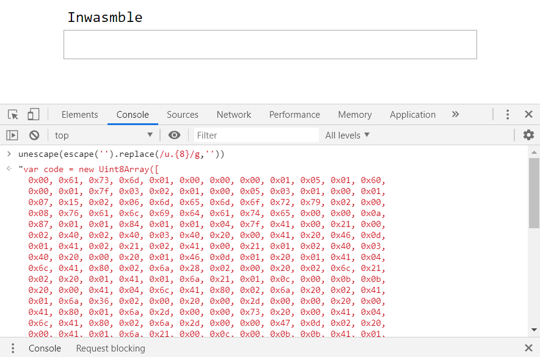
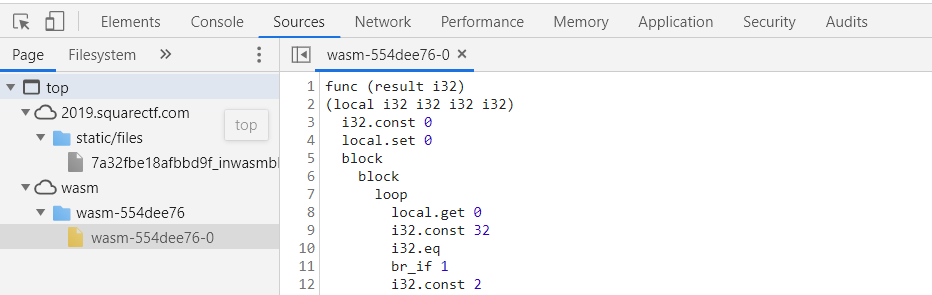
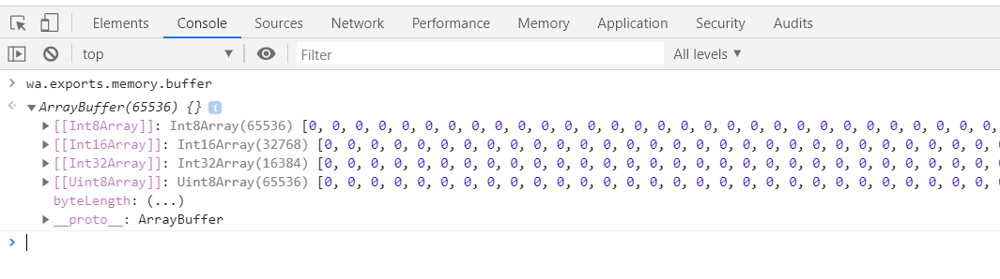
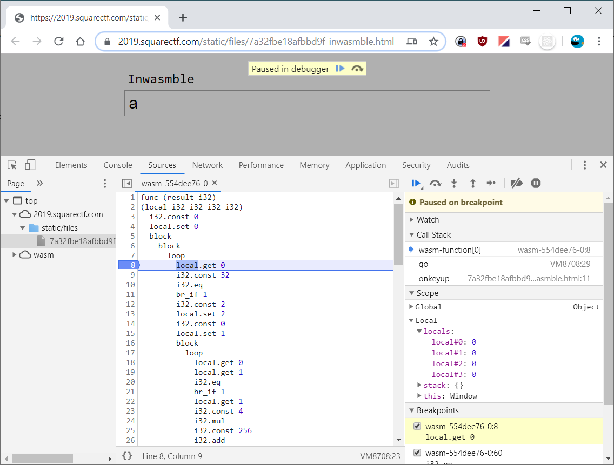

# Inwasmble
Points: 200  
Bonus (first team to solve): 20  
Topics: web  

> After watching you type around on your computer a bunch, you inspire Sam to give the ‘ol computers a try. They decide a website sounds nice. They use websites. Plenty of tutorials on how to make the thing.
> 
> “Let me know if you need any help, Sam” you say as you lay down on the couch to take a nice little nap.
> 
> Midway through a dream where you can fly but only some of the time for some reason, you feel a nudge on your shoulder.
> 
> “Hey, I, uh, need you to have a look at something.” Sam whispers.
> 
> They hand over their laptop, and you are greeted with their browser and more browser tabs of Stack Overflow than you’ve ever seen.
> 
> “I tried to do what I could,” Sam starts, “but I borrowed some snippets from the internet, and now my site doesn’t work.”
> 
> [Sam's site](7a32fbe18afbbd9f_inwasmble.html).

We start as always by viewing the source in Chrome:


Looks like it evals `escape('')`!? Copying the string to an editor reveals that it
is some type of encoding trickery:



Running the code in the console we can confirm that what is `eval`ed is
more than initially meets the eye (see full listing below image):



```js
var code = new Uint8Array([
    0x00, 0x61, 0x73, 0x6d, 0x01, 0x00, 0x00, 0x00, 0x01, 0x05, 0x01, 0x60,
    0x00, 0x01, 0x7f, 0x03, 0x02, 0x01, 0x00, 0x05, 0x03, 0x01, 0x00, 0x01,
    0x07, 0x15, 0x02, 0x06, 0x6d, 0x65, 0x6d, 0x6f, 0x72, 0x79, 0x02, 0x00,
    0x08, 0x76, 0x61, 0x6c, 0x69, 0x64, 0x61, 0x74, 0x65, 0x00, 0x00, 0x0a,
    0x87, 0x01, 0x01, 0x84, 0x01, 0x01, 0x04, 0x7f, 0x41, 0x00, 0x21, 0x00,
    0x02, 0x40, 0x02, 0x40, 0x03, 0x40, 0x20, 0x00, 0x41, 0x20, 0x46, 0x0d,
    0x01, 0x41, 0x02, 0x21, 0x02, 0x41, 0x00, 0x21, 0x01, 0x02, 0x40, 0x03,
    0x40, 0x20, 0x00, 0x20, 0x01, 0x46, 0x0d, 0x01, 0x20, 0x01, 0x41, 0x04,
    0x6c, 0x41, 0x80, 0x02, 0x6a, 0x28, 0x02, 0x00, 0x20, 0x02, 0x6c, 0x21,
    0x02, 0x20, 0x01, 0x41, 0x01, 0x6a, 0x21, 0x01, 0x0c, 0x00, 0x0b, 0x0b,
    0x20, 0x00, 0x41, 0x04, 0x6c, 0x41, 0x80, 0x02, 0x6a, 0x20, 0x02, 0x41,
    0x01, 0x6a, 0x36, 0x02, 0x00, 0x20, 0x00, 0x2d, 0x00, 0x00, 0x20, 0x00,
    0x41, 0x80, 0x01, 0x6a, 0x2d, 0x00, 0x00, 0x73, 0x20, 0x00, 0x41, 0x04,
    0x6c, 0x41, 0x80, 0x02, 0x6a, 0x2d, 0x00, 0x00, 0x47, 0x0d, 0x02, 0x20,
    0x00, 0x41, 0x01, 0x6a, 0x21, 0x00, 0x0c, 0x00, 0x0b, 0x0b, 0x41, 0x01,
    0x0f, 0x0b, 0x41, 0x00, 0x0b, 0x0b, 0x27, 0x01, 0x00, 0x41, 0x80, 0x01,
    0x0b, 0x20, 0x4a, 0x6a, 0x5b, 0x60, 0xa0, 0x64, 0x92, 0x7d, 0xcf, 0x42,
    0xeb, 0x46, 0x00, 0x17, 0xfd, 0x50, 0x31, 0x67, 0x1f, 0x27, 0x76, 0x77,
    0x4e, 0x31, 0x94, 0x0e, 0x67, 0x03, 0xda, 0x19, 0xbc, 0x51
]);

var wa = new WebAssembly.Instance(new WebAssembly.Module(code));
var buf = new Uint8Array(wa.exports.memory.buffer);

async function go() {
    sizes = [...[...Array(4)].keys()].map(x => x * 128); // [0, 128, 256, 384]
    // set buf to charCode of 128 first chars from "#x", padded with " " if x.length < 128
    // x.value = "abc"
    // buf.set((128) [97, 98, 99, 32, 32, 32, 32, 32, 32, 32, 32, 32, 32, 32, 32, 32, 32, ...])
    buf.set(x.value.substr(sizes[0], sizes[1]).padEnd(sizes[1]).split('').map(x => x.charCodeAt('')));
    if (wa.exports.validate()) {
        hash = await window.crypto.subtle.digest("SHA-1", buf.slice(sizes[2], sizes[3]));
        r.innerText = "\uD83D\uDEA9 flag-" + [... new Uint8Array(hash)].map(x => x.toString(16)).join('');
    } else {
        r.innerHTML = x.value == "" ? "&nbsp;" : "\u26D4";
    }
}
```

So a binary blob of web assembly. Why don't we let Chrome translate that
into WAT (WebAssembly Text Format)? Actually Chrome has already done so,
how thoughtful! Just navigate to the sources tab of the Chrome dev tools
and expand the wasm tree:



Below is the full textual representation of the validate function, with
some added comments:

```wast
func (result i32)
(local i32 i32 i32 i32)
  i32.const 0
  local.set 0
  block
    block
      loop
        local.get 0                         ;;
        i32.const 32                        ;;
        i32.eq                              ;; if (local0 == 32)
        br_if 1                             ;;   break;
        i32.const 2                         ;;
        local.set 2                         ;; local2 = 2
        i32.const 0                         ;;
        local.set 1                         ;; local1 = 0
        block
          loop
            local.get 0                     ;;
            local.get 1                     ;;
            i32.eq                          ;; if (local1 == local0)
            br_if 1                         ;;   break
            local.get 1                     ;;
            i32.const 4                     ;;
            i32.mul                         ;;
            i32.const 256                   ;;
            i32.add                         ;; addr = (local1 * 4) + 256
            i32.load offset=0 align=4       ;;
            local.get 2                     ;;
            i32.mul                         ;;
            local.set 2                     ;; local2 = local2 * (*addr<i32>)
            local.get 1                     ;;
            i32.const 1                     ;;
            i32.add                         ;;
            local.set 1                     ;; local1 += 1
            br 0
          end
        end                                 ;; 
        local.get 0                         ;;
        i32.const 4                         ;;
        i32.mul                             ;;
        i32.const 256                       ;;
        i32.add                             ;; 
        local.get 2                         ;;
        i32.const 1                         ;;
        i32.add                             ;; addr = local2 + 1
        i32.store offset=0 align=4          ;; *addr<i32> = (local0 * 4) + 256
        local.get 0                         ;;
        i32.load8_u offset=0 align=1        ;;
        local.get 0                         ;; 
        i32.const 128                       ;;
        i32.add                             ;;
        i32.load8_u offset=0 align=1        ;;
        i32.xor                             ;; rhs = (*local0<u8>) ^ (*(local0 + 128)<u8>)
        local.get 0                         ;;
        i32.const 4                         ;;
        i32.mul                             ;;
        i32.const 256                       ;;
        i32.add                             ;;
        i32.load8_u offset=0 align=1        ;; lhs = (*(local0 * 4 + 256)<u8>)
        i32.ne                              ;; if (lhs != rhs)
        br_if 2                             ;;   goto fail
        local.get 0                         ;;
        i32.const 1                         ;;
        i32.add                             ;;
        local.set 0                         ;; local0 += 1
        br 0
      end
    end
    i32.const 1
    return
  end
  i32.const 0                               ;; :fail
end
```

In addition to the validate function there is also some memory predefined
in the binary blob. Reloading the page (just to make sure no calls to
`wa.exports.validate()` has been made) we can inspect the value in the
console tab:



If we interpret it as a `Uint8Array` we find 32 predefined numbers,
starting at index 128 in memory:

```
128 "=>" 74
129 "=>" 106
130 "=>" 91
131 "=>" 96
132 "=>" 160
133 "=>" 100
134 "=>" 146
135 "=>" 125
136 "=>" 207
137 "=>" 66
138 "=>" 235
139 "=>" 70
140 "=>" 0
141 "=>" 23
142 "=>" 253
143 "=>" 80
144 "=>" 49
145 "=>" 103
146 "=>" 31
147 "=>" 39
148 "=>" 118
149 "=>" 119
150 "=>" 78
151 "=>" 49
152 "=>" 148
153 "=>" 14
154 "=>" 103
155 "=>" 3
156 "=>" 218
157 "=>" 25
158 "=>" 188
159 "=>" 81
```

At this point we should have everything we need. Although it should be
theoretically possible to do the reversing by hand, it is much easier to
do it in the debugger. So we set a breakpoint in the wasm source, enter
some letter in the input and try see what happens when stepping through
the code.



We fairly quickly notice that at line 60 (`i32.ne`) we compare
`inputStr[local0] ^ predefinedNumber[local0]` to some computed value that
seems to only depend on `local0`. Since we are stepping through the code
in the debugger we know the computed value (by simply looking at the value
in the "Local -> stack" window). We also know the value of the
`predefinedNumber` from what we extracted from `wa.exports.memory.buffer`
earlier.

This basically reduces the problem of finding the correct password to
solving the following equation:

```
inputStr[i] ^ predefinedNumber[i] =
inputStr[i] = computedValue[i] ^ predefinedNumber[i]
```

For the first index (=0) we have `computedValue[0] = 3` and
`predefinedNumber[0] = 74`, so the character at position 0 must be
`74 ^ 3 = 73 = "I"`. Now setting "I" as first character and again breaking
before `i32.ne` we find the computedValue for index 1 is `7`, which gives
us the second character "m".

Repeating this process for all 32 characters we end up with the password:
`Impossible is for the unwilling.`, which when entered rewards us with the
flag `flag-bee523b8ed974cb8929c3a5f2d89e4fb99694a2`!

