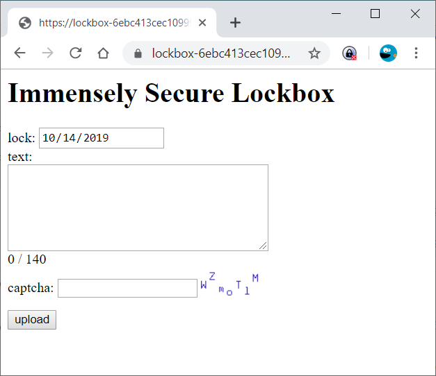

# Lockbox
Points: 600  
Bonus (first team to solve): 100  
Topics: go + web  

> “Oh, boy, that scale one was a doozy,” you mumble to yourself as you open a window to let a bit of the fresh evening air in your living room. Just then, an owl flies through your window (scaring the bejesus out of you) and drops a postcard with a [weathered image](2d54922e37f2322f_sticker.png) on one side, and a note saying “Happy 21st Birthday!” on the other. A moment later, another owl flies through and drops a lock box containing a microSD card as well as a note saying “I’m so sorry! The post card wasn’t supposed to be sent until next year, but since you have it anyways, you might as well see if you can break into it before it unlocks in 1 year! — Aunt Matilda.”
> 
> Upon opening the microSD card (why do you keep trusting all these strange objects?!), you find the following [Go code](./lockbox/lockbox.go).


The image we are given has a URL in it that takes us to a site running the
go program we have the source code for:


https://lockbox-6ebc413cec10999c.squarectf.com?id=3&hash=...

Let's start at the index page of the service instead, to get a better feel
for what the service is and does:


https://lockbox-6ebc413cec10999c.squarectf.com

It's a service for storing some text (max 140 chars) and preventing it
from being viewed until some set date. The model for stored texts is
simply:

```go
type Text struct {
	ID   uint `gorm:"primary_key"`
	Data string
	Lock int64
}
```

Where `ID` is an auto generated primary key, `Data` is the entered text
but encrypted using AES, and `Lock` is a unix timestamp representing at
what date the entry can be viewed.

Creating a new entry we also notice that each entry is protected by a
hash, which must be provided in the URL to view the entry:

https://lockbox-6ebc413cec10999c.squarectf.com/?id=767&hash=YvY1J_JIabs

This hash portion of the URL is also noticeably missing in the "weathered
image".

After reading through the code it seems unlikely that we will be able to
reconstruct the missing hash since it is created based on the content of
`Data`. We do however notice that the encryption and decryption does not
seem to be implemented correctly. For example the IV, which according to
[documentation](https://golang.org/pkg/crypto/cipher/#example_NewCBCEncrypter)
"needs to be unique, but not secure", is instead set to all zeroes:

```go
func (env *Env) encrypt(data string) string {
	// ...
	cbc := cipher.NewCBCEncrypter(block, make([]byte, block.BlockSize()))
	cbc.CryptBlocks(buf, buf)
	return base64.RawURLEncoding.EncodeToString(buf)
}
```

We also notice that the captcha is generated by decrypting whatever is
given as `c` parameter using the same `env.decrypt` as used for decrypting
a `Text` entry:

```go
func (env *Env) captcha(w http.ResponseWriter, r *http.Request) {
	c := env.decrypt(r.URL.Query().Get("c"))
	// Write c to .png
}
```

This should mean that we can use the captcha endpoint to decrypt the
Data field of a Text entry. And the most probable way of obtaining the
Data field is through an SQL injection. Finding an SQL injection turns
out to be fairly simple. The only query is done in `fetch`, using the
`First` method:

```go
func (env *Env) fetch(w http.ResponseWriter, r *http.Request) {
	var text Text
    panicIfError(env.db.First(&text, r.URL.Query().Get("id")).Error)
    // ...
}
```

We know from the imports that the code is using GORM as ORM. Consulting
its [documentation](http://gorm.io/docs/query.html) we find an intersting
note:

```go
// Get record with primary key (only works for integer primary key)
db.First(&user, 10)
```

Although `Text` indeed has an integer primary key, what the code is
passing as 2nd parameter to the `First` method is a string 
(`r.URL.Query().Get("id")`). From the documentation this seems like it may
allow for executing raw SQL:

```go
// Get by primary key if it were a non-integer type
db.First(&user, "id = ?", "string_primary_key")
//// SELECT * FROM users WHERE id = 'string_primary_key' LIMIT 1;
```

We can pretty easily validate that this is indeed the case by modifying
the id parameter to the Text we created earlier:

[https://lockbox-6ebc413cec10999c.squarectf.com/?id=id=767 and 1=2](https://lockbox-6ebc413cec10999c.squarectf.com/?id=id%3D767%20and%201%3D2)  
[https://lockbox-6ebc413cec10999c.squarectf.com/?id=id=767 and 1=1](https://lockbox-6ebc413cec10999c.squarectf.com/?id=id%3D767%20and%201%3D1)  

The errors we got for the two links differs! The first link returns a
`"record not found"`, whereas the second link return `"bad hash"`. This
indicates that the SQL is indeed evaluated.

However, trying to do any kind of unioning or joining seems to be not
possible due to how the ORM has structured the query. This doesn't really
matter too much though. Since we can differentiate between a match and not
we can bruteforce the `Data` field one character at a time. This
bruteforce was implemented as a (actually 2 variants with slightly
different implementations) python script, see [fetcher.py](./fetcher.py)
and [brute.py](./brute.py).

After a while the script is finished and we have the `Data` field. Passing
it to the captcha endpoint actually works right away. Adjusting the width
to fit the entire message and we get our flag:


https://lockbox-6ebc413cec10999c.squarectf.com/captcha?w=800&c=Nw12G_0K_xYt4ZR3mO7cKuc5CFrrszCysLZrLgxhoGcakkjTs7x86DotIiD5fzgSZYK-zX3bWTE-dEJrmPBlgQ
